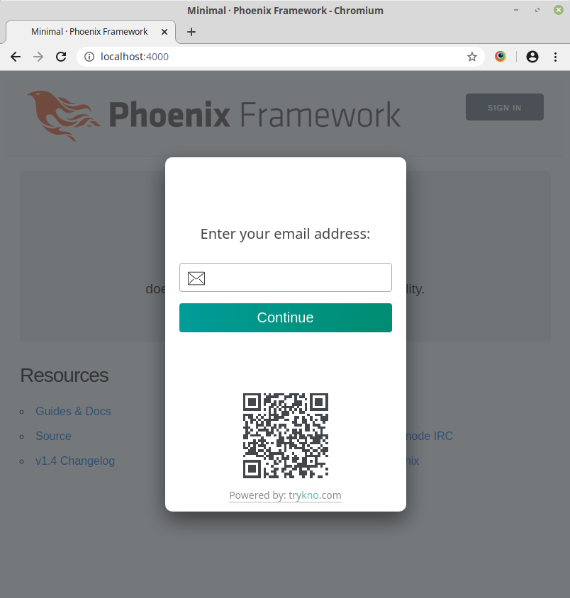

# Kno Elixir
### Go Passwordless

Use [trykno.com](https://trykno.com) for the simplest way to add passwordless authentication to your application.

## Installation

Add Kno to your list of dependencies in `mix.exs`.

```elixir
defp deps do
  [
    # ...
    {:kno, "~> 0.1.0"}
  ]
end
```

Run `mix deps.get` to install it.

## Get started with Phoenix

#### Configure Kno

Add `Kno.Plug.Session` to you applications endpoint file, found at `lib/my_app_web/endpoint.exs`.
Must be added after `Plug.Session`.

```elixir
defmodule MyAppWeb.Endpoint do
  # ...

  plug Plug.Session, # session config

  # Must be added after Plug.Session
  plug Kno.Plug.Session,
    success_redirect: "/users"

  # ...
end
```

#### Modify templates

Add the sign in and out buttons to your template. To have the buttons on every page add them to the app template found in `lib/my_app_web/templates/layout/app.html.eex`.

```eex
<!-- ... -->
  <%= Kno.Plug.session_buttons(@conn) %>
<!-- ... -->
```

#### Check user is authenticated

Controllers can fetch the `persona_id` that identifies the user. `nil` is returned if unauthenticated.

```elixir
case Kno.Plug.persona_id(conn) do
  nil ->
    # User is unauthenticated
  persona_id ->
    # ...
end
```

### Local development

Authentication is now setup for local development.
Restart your phoenix application and click the sign in button.



Enter your **real** email address. Kno runs a service for local development that sends a limited number of emails.

### Get production keys

Create an account at [trykno.com](https://trykno.com) and follow the guidance to create your first space.
This will direct you to create a `site_token` and `api_token`.
Add these to your environment and edit the configuration in your endpoint file.

```elixir
  plug Kno.Plug.Session,
    success_redirect: "/users",
    site_token: System.get_env("KNO_SITE_TOKEN"),
    api_token: System.get_env("KNO_API_TOKEN")
```

**NOTE: The tokens do not have to be stored in the environment.
However the api token MUST be kept secure and should not be committed to your applications source code.**

## Questions

If you have any further questions or want to find out more about Kno, visit [trykno.com](https://trykno.com) or contact us at [team@trykno.com](mailto:team@trykno.com?subject=Kno-Elixir%20question).
