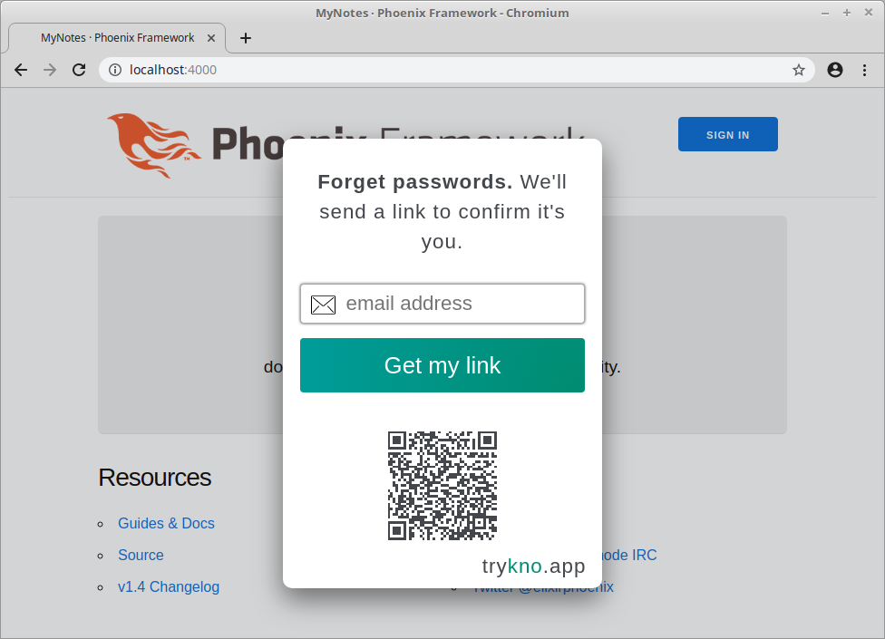
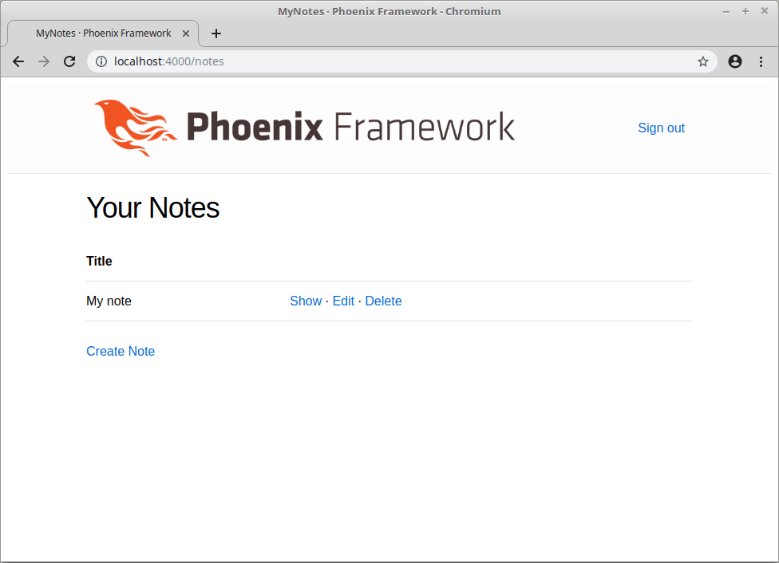

# Kno Elixir
**[trykno.com](https://trykno.com) secure and simple passwordless authentication. Start authenticating users in 10 minutes.**

- [Phoenix integration guide](#phoenix_integration-guide)
- [community](https://forgetpasswords.com)
- Get in touch [team@trykno.com](mailto:team@trykno.com?subject=Kno-Elixir%20question)

# Phoenix integration guide

*This guide requires Phoenix and Elixir.
The [Phoenix install guide](https://hexdocs.pm/phoenix/installation.html#content) can help you get both of these set up.*

## Setup project

We are going to build a note taking app called `my_notes`.
[Kno](https://trykno.com) will allow us to authenticate users and protect their notes.

```sh
mix phx.new my_notes --no-webpack
cd my_notes
```

Open up `mix.exs` and add HTTPoison and Jason as dependencies.

```elixir
defp deps do
  [
    # existing dependencies
    {:jason, "~> 1.1"},
    {:httpoison, "~> 1.6"},
  ]
end
```

Then run `mix deps.get` to pull the new dependencies.

## Configure API and site tokens

Next configure the tokens associated without your application.
Add the following code to `config/dev.exs`

```elixir
config :my_notes,
  kno_site_token: "site_UITYJw8kQJilzVnux5VOPw",
  kno_api_token: "API_AAAAAgDOxdmUqKpE9rw82Jj0Y6DM"
```

*For production you will have keys unique to your application.
However you can use the tokens in this example as long as your example is running from localhost.*

**Please note that emails will be sent so you can test.
Ensure you use real email addresses so you do not get blocked from using these credentials for local development**

## Display sign in/out buttons

Add the following code to `lib/my_notes_web/templates/layout/app.html.eex`, so that a user can sign in or out from any page.

```eex
<%= if authenticated?(@conn) do %>
  <%= link "Sign out", to: Routes.session_path(@conn, :sign_out) %>
<% else %>
  <%= form_for @conn, Routes.session_path(@conn, :sign_in), fn _form -> %>
    <script
      src="https://trykno.app/pass.js"
      data-site="<%= Application.get_env(:my_notes, :kno_site_token) %>">
    </script>
    <%= submit "Sign in" %>
  <% end %>
<% end %>
```

The `authenticated?` function is a helper that we define later.

For authenticated users a link to sign out is shown.
This link points to the `:sign_out` action found on the `MyNotesWeb.Session` controller.

Authenticated users see a button that will start the process of signing in.

Here we are using the [simple Kno integration](https://trykno.com/docs/#kno-now) as it is the fastest way to get started.
When the form is submitted, a sign in overlay is shown. Once the client has been authenticated by token is added to a **knoToken** field in the form.
This form, and the **knoToken**, are submitted to the`:sign_in` action on the `MyNotesWeb.Session` controller.

### Define the authenticated? helper.

The helper function, used to tell if our user is authenticated, is defined in `lib/my_notes_web/views/layout_view.ex`.

```elixir
def authenticated?(conn) do
  case Plug.Conn.get_session(conn, :persona_id) do
    persona_id when is_binary(persona_id) ->
      true

    nil ->
      false
  end
end
```

## Handle sign in/out actions

In `lib/my_notes_web/router.ex` add the two routes to the top level `"/"` scope pointing to a `SessionController`.

```elixir
scope "/", HelloWeb do
  pipe_through :browser

  get "/", PageController, :index
  post "/sign-in", SessionController, :sign_in
  get "/sign-out", SessionController, :sign_out
end
```

Create a session controller to handle updating the users session when a user signs in or out.
Add to `lib/my_notes_web/controllers/session_controller.ex`.

```elixir
defmodule MyNotesWeb.SessionController do
  use MyNotesWeb, :controller

  def sign_in(conn, %{"knoToken" => token}) do
    persona_id = verify_token!(token)

    conn
    |> put_session(:persona_id, persona_id)
    |> redirect(to: "/notes")
  end

  def sign_out(conn, _params) do
    conn
    |> clear_session()
    |> redirect(to: "/")
  end

  defp verify_token!(token) do
    api_token = Application.get_env(:my_notes, :kno_api_token)

    url = "https://api.trykno.app/v0/authenticate"
    headers = [
      {"authorization", "Basic #{Base.encode64(api_token <> ":")}"},
      {"content-type", "application/json"}
    ]
    body = Jason.encode!(%{token: token})

    %{status_code: 200, body: response_body} = HTTPoison.post!(url, body, headers)
    %{"persona" => %{"id" => persona_id}} = Jason.decode!(response_body)
    persona_id
  end
end
```

The `verify_token` function makes a single API call to upgrade the token submitted from the client to the persona information.
The information returned from this call identifies a persona specific to your application rather than sensitive user data.
For this guide the difference between a persona and user is not important.

Once authenticated, the session controller adds the persona_id to the session.

## Try out sign in/out

At this point you should be able to start you application.

```shell
mix phx.server
```

visit [localhost:4000](http://localhost:4000) and try signing in and out.
At this point our application can't do any more than this.



## Saving notes in the database

Now is the time to add some notes to our notes application.
Add a migration to create a notes table so that the application can save notes in the database.

```shell
mix ecto.gen.migration create_notes
```

In the generated file at `/priv/repo/migrations/[timestamp]_create_notes.exs` create a table for notes with a title content persona_id and timestamps.
The timestamps are used so a user can see the notes in the order they created them.

```elixir
defmodule MyNotes.Repo.Migrations.CreateNotes do
  use Ecto.Migration

  def change do
    create table(:notes) do
      add :persona_id, :binary_id, null: false
      add :title, :text, null: false
      add :content, :text, null: false
      timestamps(type: :utc_datetime)
    end

    create index(:notes, :persona_id)
  end
end
```

Then run `mix ecto.migrate` to apply the migration to your database.
Before running this for the first time you will need to run `mix ecto.create`.

Create the file `lib/my_notes/note.ex` in which we will add the Ecto model for accessing notes in the database.

```elixir
defmodule MyNotes.Note do
  use Ecto.Schema

  schema "notes" do
    field :persona_id, :binary_id
    field :title, :string
    field :content, :string
    timestamps(type: :utc_datetime)
  end

  def changeset(note, attrs) do
    import Ecto.Changeset

    note
    |> cast(attrs, [:title, :content])
    |> validate_required([:title, :content])
  end
end
```

Add the logic for managing notes to `lib/my_notes.ex` so that we can use a clean interface to the core logic from a notes controller.

```elixir
defmodule MyNotes do

  import Ecto.Query, warn: false

  alias MyNotes.Note
  alias MyNotes.Repo

  @doc """
  Returns the list of notes for a given persona id.
  """
  def list_notes(persona_id) when is_binary(persona_id) do
    from(n in Note, where: n.persona_id == ^persona_id, order_by: :inserted_at)
    |> Repo.all()
  end

  @doc """
  Gets a single note owned by a persona.
  """
  def get_note!(id, persona_id), do: Repo.get_by!(Note, id: id, persona_id: persona_id)

  @doc """
  Creates a note for a persona.
  """
  def create_note(attrs, persona_id) do
    %Note{persona_id: persona_id}
    |> Note.changeset(attrs)
    |> Repo.insert()
  end

  @doc """
  Updates an existing note.
  """
  def update_note(%Note{} = note, attrs) do
    note
    |> Note.changeset(attrs)
    |> Repo.update()
  end

  @doc """
  Deletes a Note.
  """
  def delete_note(%Note{} = note) do
    Repo.delete(note)
  end

  @doc """
  Returns an `%Ecto.Changeset{}` for tracking note changes.
  """
  def change_note(%Note{} = note) do
    Note.changeset(note, %{})
  end
end
```

Once a user has signed in they can Create Read Update & Delete (CRUD) notes that belong to them.
The `MyNotes` module provides an interface for all these actions.

## Create a notes controller and views

Now it's time to create a controller for users to work with their notes.
This will live in `lib/my_notes_web/controllers/note_controller.ex`.

```elixir
defmodule MyNotesWeb.NoteController do
  use MyNotesWeb, :controller

  def index(conn, _params) do
    %{persona_id: persona_id} = conn.assigns

    notes = MyNotes.list_notes(persona_id)
    render(conn, "index.html", notes: notes)
  end

  def new(conn, _params) do
    %{persona_id: persona_id} = conn.assigns

    changeset = MyNotes.change_note(%MyNotes.Note{persona_id: persona_id})
    render(conn, "new.html", changeset: changeset)
  end

  def create(conn, %{"note" => note_params}) do
    %{persona_id: persona_id} = conn.assigns

    case MyNotes.create_note(note_params, persona_id) do
      {:ok, note} ->
        conn
        |> put_flash(:info, "Note created successfully.")
        |> redirect(to: Routes.note_path(conn, :show, note))

      {:error, %Ecto.Changeset{} = changeset} ->
        render(conn, "new.html", changeset: changeset)
    end
  end

  def show(conn, %{"id" => id}) do
    %{persona_id: persona_id} = conn.assigns

    note = MyNotes.get_note!(id, persona_id)
    render(conn, "show.html", note: note)
  end

  def edit(conn, %{"id" => id}) do
    %{persona_id: persona_id} = conn.assigns

    note = MyNotes.get_note!(id, persona_id)
    changeset = MyNotes.change_note(note)
    render(conn, "edit.html", note: note, changeset: changeset)
  end

  def update(conn, %{"id" => id, "note" => note_params}) do
    %{persona_id: persona_id} = conn.assigns

    note = MyNotes.get_note!(id, persona_id)

    case MyNotes.update_note(note, note_params) do
      {:ok, note} ->
        conn
        |> put_flash(:info, "Note updated successfully.")
        |> redirect(to: Routes.note_path(conn, :show, note))

      {:error, %Ecto.Changeset{} = changeset} ->
        render(conn, "edit.html", note: note, changeset: changeset)
    end
  end

  def delete(conn, %{"id" => id}) do
    %{persona_id: persona_id} = conn.assigns

    note = MyNotes.get_note!(id, persona_id)
    {:ok, _note} = MyNotes.delete_note(note)

    conn
    |> put_flash(:info, "Note deleted successfully.")
    |> redirect(to: Routes.note_path(conn, :index))
  end
end
```

For each action the controller uses the business logic defined in the previous section.
Every action that needs a persona_id extracts it from the assign property of the conn,
relying on authentication to be handled at a before.

We will ensure that authentication is always handled by writing a plug that will be added to the pipeline before the controller is called.

Add a view module in `lib/my_notes_web/views/note_view.ex` to generate the `render` functions used in this controller.

```elixir
defmodule MyNotesWeb.NoteView do
  use MyNotesWeb, :view
end
```

No extra functionallity is needed in this view, so all that remains is to create the following templates:

*lib/my_notes_web/templates/note/index.html.eex*
```eex
<h1>Your Notes</h1>

<table>
  <thead>
    <tr>
      <th>Title</th>
      <th></th>
    </tr>
  </thead>
  <tbody>
  <%= for note <- @notes do %>
    <tr>
      <td><%= note.title %></td>
      <td>
        <%= link "Show", to: Routes.note_path(@conn, :show, note) %> &middot;
        <%= link "Edit", to: Routes.note_path(@conn, :edit, note) %> &middot;
        <%= link "Delete", to: Routes.note_path(@conn, :delete, note), method: :delete, data: [confirm: "Are you sure?"] %>
      </td>
    </tr>
  <% end %>
  </tbody>
</table>

<span><%= link "Create Note", to: Routes.note_path(@conn, :new) %></span>
```

*lib/my_notes_web/templates/note/form.html.eex*
```eex
<%= form_for @changeset, @action, fn f -> %>
  <%= if @changeset.action do %>
    <div class="alert alert-danger">
      <p>Oops, something went wrong! Please check the errors below.</p>
    </div>
  <% end %>

  <%= label f, :title %>
  <%= text_input f, :title %>
  <%= error_tag f, :title %>

  <%= label f, :content %>
  <%= textarea f, :content, rows: "20" %>
  <%= error_tag f, :content %>

  <div>
    <%= submit "Save" %>
  </div>
<% end %>
```

*lib/my_notes_web/templates/note/new.html.eex*
```eex
<h1>New Note</h1>

<%= render "form.html", Map.put(assigns, :action, Routes.note_path(@conn, :create)) %>

<span><%= link "Back", to: Routes.note_path(@conn, :index) %></span>
```

*lib/my_notes_web/templates/note/show.html.eex*
```eex
<h2><%= @note.title %></h2>

<div class="preformatted">
  <%= @note.content %>
</div>

<hr />

<span><%= link "Edit", to: Routes.note_path(@conn, :edit, @note) %></span> &middot;
<span><%= link "Back", to: Routes.note_path(@conn, :index) %></span>
```

*lib/my_notes_web/templates/note/edit.html.eex*
```eex
<h1>Edit Note</h1>

<%= render "form.html", Map.put(assigns, :action, Routes.note_path(@conn, :update, @note)) %>

<span><%= link "Back", to: Routes.note_path(@conn, :index) %></span>

```

## Protecting note routes

Add the following code to `lib/my_notes_web/router.ex`.

```elixir
alias MyNotesWeb.Router.Helpers, as: Routes

scope "/notes", MyNotesWeb do
  pipe_through [:browser, :ensure_authenticated]

  resources "/", NoteController
end

def ensure_authenticated(conn, _) do
  case get_session(conn, :persona_id) do
    nil ->
      conn
      |> put_flash(:error, "You don't have permission to access that page")
      |> redirect(to: Routes.page_path(conn, :index))
      |> halt()

    persona_id when is_binary(persona_id) ->
      conn
      |> assign(:persona_id, persona_id)
  end
end
```

All of the CRUD actions are defined by the `resource` macro.

By adding `ensure_authenticated` to the `pipe_through` section every client request is first passed through this function.
This `ensure_authenticated` plug checks that the session contains a persona_id.
For unauthenticated sessions the request is redirected with an error and halted.
If a persona_id was present it is added as an assign property on the plug, the request will then continue up the pipeline to be handled by the notes controller.

## Try it out

At this point we have a working notes application.
Try it out by visiting [localhost:4000](http://localhost:4000/notes).
If you have had any trouble you can pull the finished example [here](examples/phoenix_integration)



If you have any further questions or want to find out more about Kno, visit [trykno.com](https://trykno.com) or contact us at [team@trykno.com](mailto:team@trykno.com?subject=Kno-Elixir%20question).
